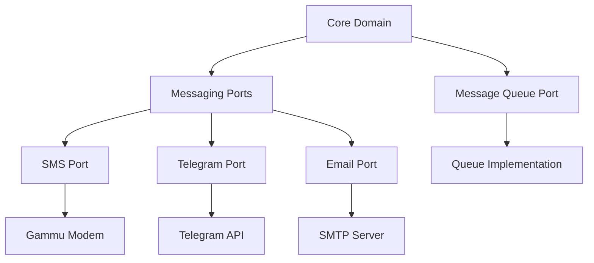

# SMS Gateway Architecture

This document describes the architecture of the SMS Gateway daemon.

## Overview

The SMS Gateway is designed using Clean Architecture principles with a Port and Adapter pattern. This allows for flexible integration of different messaging services while maintaining a clean separation of concerns.

## Core Components

### Domain Models

Located in `sms_gateway/domain/models.py`:

- `Message`: Represents a message to be sent through the gateway
  - Core fields: content, sender, destinations, priority
  - retry_count: Tracks number of failed delivery attempts for better retry handling
- `Destination`: Defines a message destination with type and address
- `BaseConfig`: Base configuration for all services
- Service-specific configs:
  - `TelegramConfig`
  - `EmailConfig`
  - `GammuConfig`
  - `SMSGatewayConfig`

### Ports (Interfaces)

The system defines several protocol interfaces for messaging services:

#### Base Messaging Port
Located in `sms_gateway/ports/messaging.py`:
- `MessagingPort`: Base protocol for all messaging services
  - `send_message()`: Send a message through the service
  - `initialize()`: Initialize the service with configuration
  - `shutdown()`: Cleanup and shutdown the service

#### Service-Specific Ports
Located in `sms_gateway/ports/protocols/`:

- `SMSPort`: GSM modem messaging capabilities
  - Asynchronous modem control through async-gsm-modem
  - Message sending and receiving with cleanup
  - Automatic message queue management
  - Signal strength and modem status monitoring

- `TelegramPort`: Telegram bot messaging capabilities
  - Chat management and information
  - File sending support
  - Bot status monitoring

- `EmailPort`: Email messaging capabilities
  - SMTP server management
  - Attachment support
  - Connection verification

#### Message Queue Port
Located in `sms_gateway/ports/message_queue.py`:
- `MessageQueuePort`: Interface for message queue operations
  - `enqueue()`: Add message to queue
  - `dequeue()`: Get next message from queue
  - `stream()`: Stream messages as they arrive

## Architecture Diagram



## Message Service Implementation

### Base Message Service

The [`MessageService`](../sms_gateway/services/base.py) class provides core message handling functionality:

1. Message Reception:
   - Continuously monitors configured ports
   - Validates and normalizes incoming messages
   - Routes messages to appropriate queues

2. Message Processing:
   - Dequeues messages for processing
   - Attempts delivery through available ports
   - Implements retry logic with max retry limit:
     - Tracks retry attempts per message (up to 5 retries)
     - Increments retry count on each failure
     - Messages exceeding retry limit are discarded
     - Detailed logging of retry status and final failures
   - Handles errors and logging with retry count information

3. Port Management:
   - Maintains list of active messaging ports
   - Handles port initialization and shutdown
   - Monitors port health and status

### Service-Specific Implementations

Service implementations extend the base MessageService:

1. SMS Service:
   - Handles GSM modem communication through python-gammu library
   - Manages message delivery status and cleanup
   - Monitors signal strength and modem state
   - Supports sending and receiving SMS messages

2. Telegram Service:
   - Manages bot sessions
   - Handles chat updates
   - Supports media messages

3. Email Service:
   - Manages SMTP connections
   - Handles attachments
   - Supports HTML content

## Queue System

The queue system is built around a factory pattern for creating message queues. The implementation is split into two main components:

1. Queue Factory:
   - Located in `sms_gateway/adapters/queues/factory.py`
   - Creates queue instances based on configuration
   - Supports different queue types (currently in-memory)
   - Extensible for future queue implementations

2. Memory Queue Implementation:
   - Located in `sms_gateway/adapters/queues/memory.py`
   - Based on `asyncio.Queue`
   - Features:
     - Asynchronous message handling
     - Configurable queue size
     - Non-blocking operations
     - Size monitoring
     - Empty/full state detection
     - Error handling for edge cases

## Message Flow Details

1. Incoming Flow:
   ```mermaid
   sequenceDiagram
       participant A as Adapter
       participant S as Service
       participant Q as Queue
       
       A->>S: New Message
       S->>S: Validate Message
       S->>Q: Enqueue
       Q->>S: Dequeue
       S->>A: Send via Port
   ```

2. Processing Steps:
   a. Message received via adapter
   b. Service validates and normalizes
   c. Message enqueued to outgoing queue
   d. Processing service dequeues
   e. Port selection based on message type
   f. Delivery attempt with retry logic

3. Error Handling:
    - Port failures trigger retries with strict limits:
      - Maximum 5 retry attempts per message
      - Retry count tracked in Message model
      - Messages discarded after max retries reached
      - Detailed logging of retry attempts and final failures
    - Messages track failed delivery attempts for retry management
    - Queue overflow protection
    - Logging at each step with retry attempt information
    - Error reporting to monitoring

This architecture provides:
- Clean separation of concerns
- Easy addition of new services
- Type-safe message handling
- Flexible message routing
- Robust error handling
- Efficient async processing