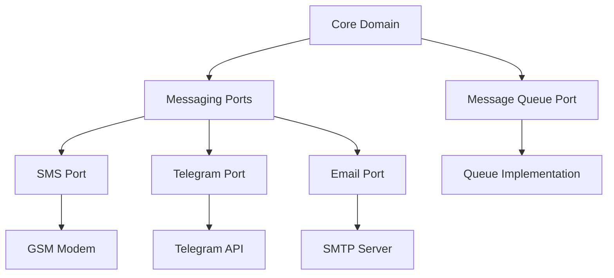

# SMS Gateway Architecture

This document describes the architecture of the SMS Gateway daemon.

## Overview

The SMS Gateway is designed using Clean Architecture principles with a Port and Adapter pattern. This allows for flexible integration of different messaging services while maintaining a clean separation of concerns.

## Core Components

### Domain Models

Located in `sms_gateway/domain/models.py`:

- `Message`: Represents a message to be sent through the gateway
- `Destination`: Defines a message destination with type and address
- `BaseConfig`: Base configuration for all services
- Service-specific configs:
  - `TelegramConfig`
  - `EmailConfig`
  - `GSMModemConfig`
  - `SMSGatewayConfig`

### Ports (Interfaces)

The system defines several protocol interfaces for messaging services:

#### Base Messaging Port
Located in `sms_gateway/ports/messaging.py`:
- `MessagingPort`: Base protocol for all messaging services
  - `send_message()`: Send a message through the service
  - `initialize()`: Initialize the service with configuration
  - `shutdown()`: Cleanup and shutdown the service

#### Service-Specific Ports
Located in `sms_gateway/ports/protocols/`:

- `SMSPort`: GSM modem messaging capabilities
  - Modem control and status monitoring
  - Signal strength checking
  - Hardware information retrieval

- `TelegramPort`: Telegram bot messaging capabilities
  - Chat management and information
  - File sending support
  - Bot status monitoring

- `EmailPort`: Email messaging capabilities
  - SMTP server management
  - Attachment support
  - Connection verification

#### Message Queue Port
Located in `sms_gateway/ports/message_queue.py`:
- `MessageQueuePort`: Interface for message queue operations
  - `enqueue()`: Add message to queue
  - `dequeue()`: Get next message from queue
  - `stream()`: Stream messages as they arrive

## Architecture Diagram

## Message Flow

1. Message received through any adapter
2. Message converted to domain model
3. Message enqueued for processing
4. Message processor dequeues message
5. Appropriate messaging port selected based on destination
6. Message sent through selected port

This architecture ensures:
- Clean separation of concerns
- Easy addition of new messaging services
- Type-safe message handling
- Flexible message routing