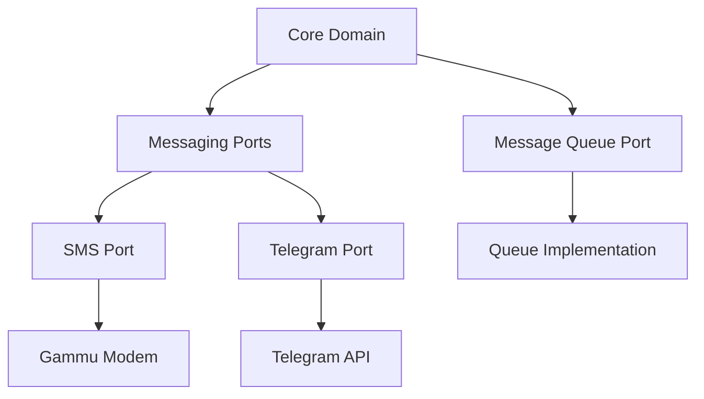

# SMS Gateway Architecture

This document describes the architecture of the SMS Gateway daemon.

## Overview

The SMS Gateway is designed using Clean Architecture principles with a Port and Adapter pattern. This allows for flexible integration of different messaging services while maintaining a clean separation of concerns.

## Core Components

### Domain Models

Located in `sms_gateway/domain/models.py`:

- `Message`: Represents a message to be sent through the gateway
  - Core fields: content, sender, destinations, priority
  - retry_count: Tracks number of failed delivery attempts for better retry handling
- `Destination`: Defines a message destination with type and address
- `SMSGatewayConfig`: Top level configuration for the SMS Gateway

Located in `sms_gateway/integrations/config/`:

- `base.py`: Contains `BaseConfig`, the base configuration model with:
  - enabled: Determines if service is active
  - name: Service identifier
- Service-specific configs inherit from BaseConfig:
  - `telegram.py`: `TelegramConfig` for Telegram integration
  - `gammu.py`: `GammuConfig` for GSM modem integration
  - `stub.py`: `StubConfig` for testing
### Configuration System

Located in `sms_gateway/domain/config/`:

1. Runtime Configuration:
   - `runtime.py`: System-wide settings including logging
   - `queue.py`: Message queue settings and behavior
   - `adapters.py`: Service adapter configurations

2. Registry System (`sms_gateway/common/registry.py`):
   - `AdapterType`: Enum defining supported adapter categories (SMS, INTEGRATION)
   - `AdapterRegistry`: Central registry for all messaging adapters
   - Factory pattern for creating adapter instances
   - Type-safe adapter management and initialization

### Ports (Interfaces)

The system defines several protocol interfaces for messaging services:

#### Base Messaging Port
Located in `sms_gateway/ports/messaging.py`:
- `MessagingPort`: Base protocol for all messaging services
  - `send_message()`: Send a message through the service
  - `initialize()`: Initialize the service with configuration
  - `shutdown()`: Cleanup and shutdown the service

#### Service-Specific Ports
Located in `sms_gateway/ports/protocols/`:

- `SMSPort`: GSM modem messaging capabilities
  - Asynchronous modem control through async-gsm-modem
  - Message sending and receiving with cleanup
  - Automatic message queue management
  - Signal strength and modem status monitoring

- `TelegramPort`: Telegram bot messaging capabilities
  - Chat management and information
  - File sending support
  - Bot status monitoring

#### Message Queue Port
Located in `sms_gateway/ports/message_queue.py`:
- `MessageQueuePort`: Interface for message queue operations
  - `enqueue()`: Add message to queue
  - `dequeue()`: Get next message from queue
  - `stream()`: Stream messages as they arrive

## Architecture Diagram



## Message Service Implementation

### Base Message Service

The [`MessageService`](../sms_gateway/services/base.py) class provides core message handling functionality:

1. Message Reception:
   - Continuously monitors configured ports
   - Validates and normalizes incoming messages
   - Routes messages to appropriate queues

2. Message Processing:
   - Dequeues messages for processing
   - Attempts delivery through available ports
   - Implements retry logic with max retry limit:
     - Tracks retry attempts per message (up to 5 retries)
     - Increments retry count on each failure
     - Messages exceeding retry limit are discarded
     - Detailed logging of retry status and final failures
   - Handles errors and logging with retry count information

3. Port Management:
   - Maintains list of active messaging ports
   - Handles port initialization and shutdown
   - Monitors port health and status

### Service-Specific Implementations

Service implementations extend the base MessageService:

1. SMS Service:
   - Handles GSM modem communication through python-gammu library
   - Manages message delivery status and cleanup
   - Monitors signal strength and modem state
   - Supports sending and receiving SMS messages

2. Telegram Service:
   - Manages bot sessions
   - Handles chat updates
   - Supports media messages

## Queue System

The queue system provides message routing and storage between services. Implementation consists of:

1. Queue Factory (`sms_gateway/adapters/queues/factory.py`):
   - Creates strongly-typed queue instances
   - Supports configurable queue types
   - Validates queue configuration
   - Extensible for new implementations

2. Memory Queue (`sms_gateway/adapters/queues/memory.py`):
   - Async implementation using `asyncio.Queue`
   - Features:
     - Configurable size limits
     - Non-blocking operations
     - Queue metrics tracking
     - Back-pressure handling
     - Comprehensive error handling
     - Message persistence (optional)

3. Queue Configuration (`sms_gateway/domain/config/queue.py`):
   - Separate configs for SMS and integration queues
   - Size and behavior settings
   - Message retention policies
   - Error handling configuration

## Message Flow Details

1. Incoming Flow:
   ```mermaid
   sequenceDiagram
       participant A as Adapter
       participant S as Service
       participant Q as Queue
       
       A->>S: New Message
       S->>S: Validate Message
       S->>Q: Enqueue
       Q->>S: Dequeue
       S->>A: Send via Port
   ```

2. Processing Steps:
   a. Message received via adapter
   b. Service validates and normalizes
   c. Message enqueued to outgoing queue
   d. Processing service dequeues
   e. Port selection based on message type
   f. Delivery attempt with retry logic

3. Error Handling:
     - Comprehensive retry system:
       - Configurable retry limits per message type
       - Exponential backoff with jitter
       - Per-message retry tracking
       - Failed message handling policies
     - Detailed error reporting:
       - Structured logging with context
       - Error aggregation and monitoring
       - Queue health metrics
       - System status monitoring
     - Failure recovery:
       - Message persistence across restarts
       - Queue overflow protection
       - Circuit breakers for failing services
       - Graceful degradation strategies

This architecture provides:
- Clean separation of concerns
- Easy addition of new services
- Type-safe message handling
- Flexible message routing
- Robust error handling
- Efficient async processing